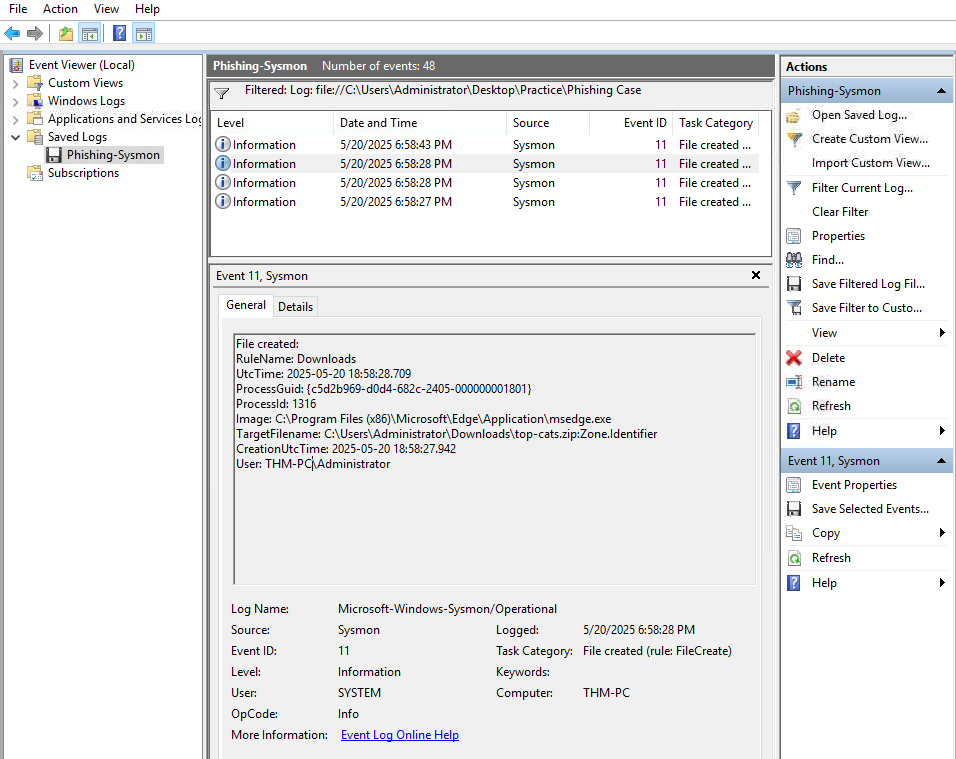
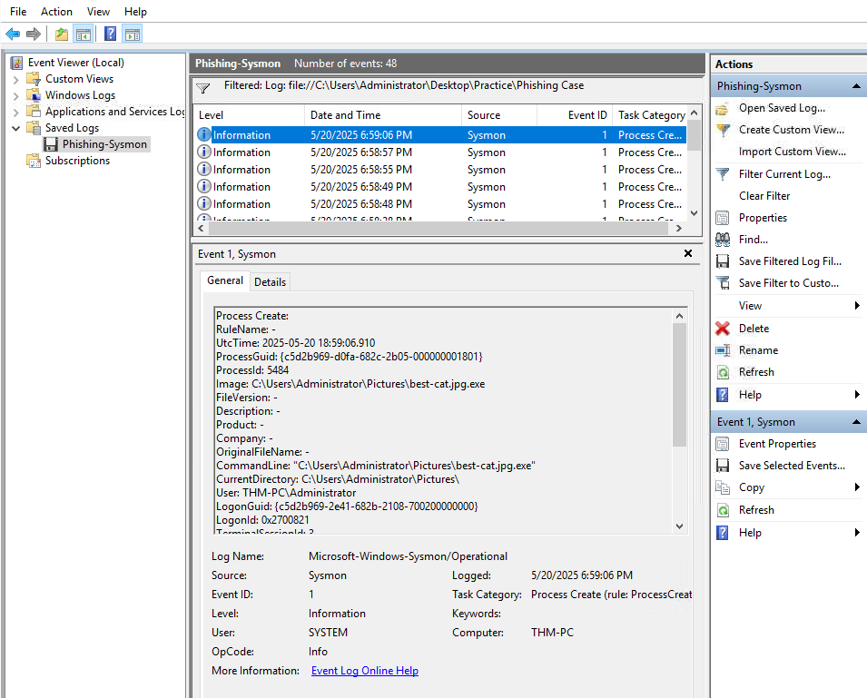
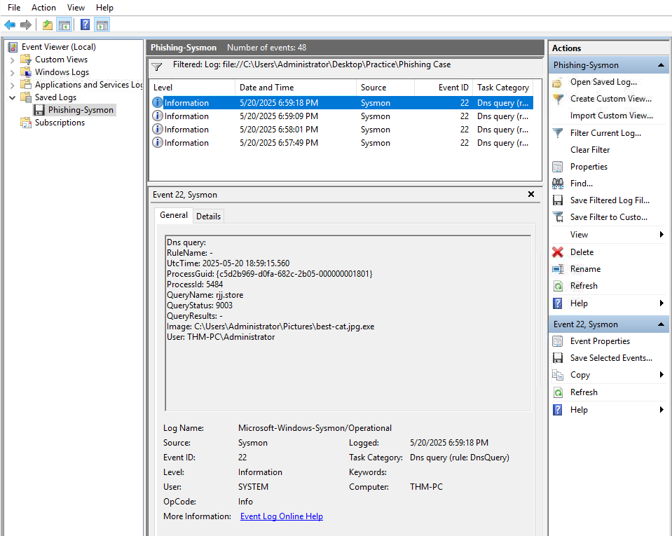

# **Sysmon Event Analysis of a Phishing Attachment Execution (TryHackMe)**

## **Badges**

---

## **Overview**
This project analyzes a phishing attachment using Sysmon event logs to trace its download, extraction, execution, and attempted external communication.

---

## **Objectives**
The investigation focused on answering the following:

- What phishing file was downloaded?
- Where was the malicious file unarchived?
- Was the malicious file executed?
- What was the PID of the malware process?
- Did the malware attempt to communicate with a remote domain or C2 server?
- Was there data exfiltration?

---

## **Tools & Data Sources**
- **Sysmon Logs**
  - Event ID 11 – File Creation
  - Event ID 1 – Process Creation
  - Event ID 22 – DNS Query
  - Event ID 3 – Network Connection
- **Windows Event Viewer / EVTX Viewer**
- **Threat Intelligence Platforms:** VirusTotal, UrlScan
- Basic log analysis techniques

---

# **Investigation Steps**

## **1. Identifying the Downloaded Phishing File (Sysmon Event ID 11)**

Analysis of Event ID 11 revealed:

- The user downloaded a cat related file.
- The file was downloaded by the user through a Microsoft Edge browser  
  (`C:\Program Files (x86)\Microsoft\Edge\Application\msedge.exe`)

This event confirms the initial delivery of the phishing attachment.

---

## **2. Determining the Extraction Folder of the Malicious File (Event ID 11)**

Further Event ID 11 entries indicated that:

- The user extracted the suspicious ZIP file.
- The extracted file had a double extension (`.jpg.exe`), a common phishing technique.
- The extraction occurred in the user’s Pictures directory.

The presence of a double extension is a strong indicator of phishing/malware.

---

## **3. Identifying Execution of the Malicious File (Sysmon Event ID 1)**

Event ID 1 logs showed:

- The extracted malicious file was executed.
- The parent process was `explorer.exe`, confirming the user executed the file.
- The process was launched from the Pictures directory.
- A new process with a suspicious name and path was created, matching the extracted payload.

This confirms the execution stage of the attack chain.

---

## **4. Finding the Malware’s Process ID (PID)**

From Sysmon Event ID 1:

- The malicious process had a unique ProcessId (PID) assigned by Windows.
- The PID was **5484**.

---

## **5. Checking Whether the Malware Attempted Network Communication (Sysmon Event ID 22)**

Sysmon Event ID 22 (DNS Query) indicated that the malware with the same PID (**5484**) attempted to resolve a domain:

- **rjj.store**

This means the malware attempted to communicate externally, possibly to:

- Fetch additional payloads  
- Contact a C2 server  
- Exfiltrate data  
- Beacon  

---

## **6. Was Data Exfiltrated?**

To determine whether data was exfiltrated, Sysmon Event ID 3 (Network Connection) was reviewed.

This event would normally show outbound connections from PID **5484**.

In this case:

- **No Sysmon Event ID 3 entries** were observed for the malware’s PID.
- Therefore, **no evidence of data exfiltration** was found.

---

# **Indicators of Compromise (IOCs)**

| Type | Value | Source |
|------|--------|---------|
| Downloaded File | `top-cats.zip` | Event ID 11 |
| Extracted Malicious File | `best-cat.jpg.exe` | Event ID 11 |
| Extraction Path | `C:\Users\<User>\Pictures\` | Event ID 11 |
| Malware PID | **5484** | Event ID 1 |
| DNS Query | `rjj.store` | Event ID 22 |

---

# MITRE ATT&CK Mapping

| Stage | Technique | ID |
|-------|-----------|----|
| Initial Access | Phishing: Attachment | T1566.001 |
| Execution | User Execution (Malicious File) | T1204.002 |
| Command & Control | DNS-Based C2 | T1071.004 |

# **Conclusion**
There is **no evidence of data exfiltration** based on the available Sysmon logs.

However, the DNS lookup (Event ID 22) to **rjj.store** indicates the malware attempted to reach out externally, so the domain should still be analyzed using Threat Intelligence to determine whether it is associated with known C2 infrastructure.

---

# **What I Learned**

### Sysmon Log Analysis
- How to follow an attack chain using Sysmon events (11 → 1 → 22 → 3).
- How to correlate logs using timestamps, paths, and PIDs.

### File & Process Forensics
- Identifying ZIP extractions and double-extension malware.
- Confirming execution through parent/child process analysis.

### DNS & Network Activity
- Using DNS Query logs (Event ID 22) to detect C2 attempts.
- Checking for exfiltration via Network Connection logs (Event ID 3).

### SOC Investigation Skills
- Triaging alerts and confirming execution paths.
- Extracting meaningful IOCs from event logs.

---
